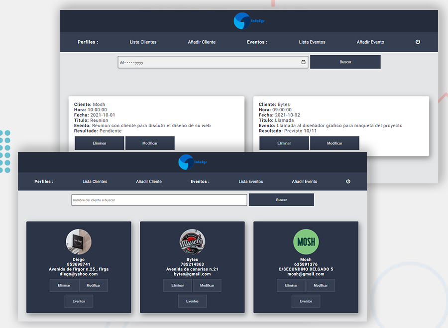

# CRM

### Tools

- [React.js](https://reactjs.org/)
- [Strapi.io](https://strapi.io/)

### Development

A Customer Relationship Management app built using React and connected to Strapi database. The app permits to create a client and any future events created with the name of the same client will be automitacally be added to the events associated to the client matched. Events and clients can be easily deleted from the database as well as from the searchbar any specific client or an event for the selected date can be found directly.

Access to the app is given only to Admin via a popup and entering the correct password (password is admin). The app can be shutdown through the dedicated power button.
